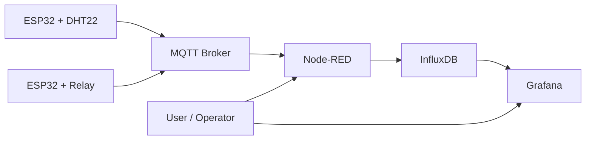
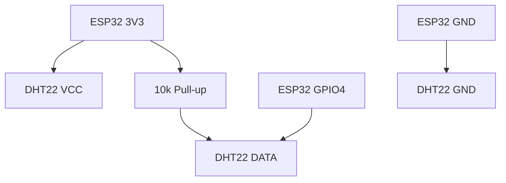
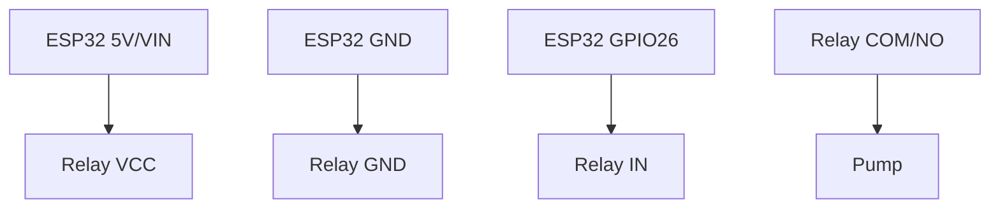

# ตัวอย่างการใช้งาน ESP32 กับระบบนี้

เอกสารนี้รวมตัวอย่างภาคปฏิบัติสำหรับต่อยอดระบบด้วยอุปกรณ์ ESP32 ในงานจริง โดยออกแบบให้สอดคล้องกับสถาปัตยกรรมของโปรเจกต์นี้

ตัวอย่างในเอกสารนี้มี 2 กรณี

1. `ESP32 + DHT22` สำหรับส่งค่าอุณหภูมิและความชื้น
2. `ESP32 + Relay` สำหรับสั่งเปิด/ปิดปั๊มน้ำ

## ภาพรวมการไหลของข้อมูล



## แนวทางตั้งชื่อ topic

ตัวอย่างนี้ใช้โครงสร้าง topic แบบเดียวกันทั้งระบบ

```text
lab/esp32-dht22/telemetry/temperature
lab/esp32-dht22/telemetry/humidity
lab/pump-01/cmd/power
lab/pump-01/status/power
```

แนวทาง

- `telemetry` ใช้ส่งค่าจากอุปกรณ์เข้า server
- `cmd` ใช้ส่งคำสั่งจาก server ไปยังอุปกรณ์
- `status` ใช้รายงานสถานะปัจจุบันของอุปกรณ์

## ตัวอย่างที่ 1: ESP32 + DHT22

### อุปกรณ์

- ESP32 DevKit
- DHT22
- ตัวต้านทาน 10k โอห์ม
- สาย jumper

### การต่อวงจร

ตัวอย่างการต่อ

- DHT22 `VCC` -> ESP32 `3V3`
- DHT22 `GND` -> ESP32 `GND`
- DHT22 `DATA` -> ESP32 `GPIO4`
- ตัวต้านทาน 10k โอห์ม ระหว่าง `DATA` กับ `3V3`

### รูปประกอบการต่อวงจร



### Library ที่ใช้ใน Arduino IDE

- `WiFi`
- `PubSubClient`
- `DHT sensor library`

### ตัวอย่างโค้ด

```cpp
#include <WiFi.h>
#include <PubSubClient.h>
#include <DHT.h>

#define DHTPIN 4
#define DHTTYPE DHT22

const char* WIFI_SSID = "YOUR_WIFI_SSID";
const char* WIFI_PASSWORD = "YOUR_WIFI_PASSWORD";
const char* MQTT_HOST = "192.168.1.50";
const int MQTT_PORT = 1883;

WiFiClient espClient;
PubSubClient mqttClient(espClient);
DHT dht(DHTPIN, DHTTYPE);

unsigned long lastPublish = 0;

void connectWiFi() {
  WiFi.begin(WIFI_SSID, WIFI_PASSWORD);
  while (WiFi.status() != WL_CONNECTED) {
    delay(500);
  }
}

void connectMQTT() {
  while (!mqttClient.connected()) {
    String clientId = "esp32-dht22-" + String((uint32_t)ESP.getEfuseMac(), HEX);
    mqttClient.connect(clientId.c_str());
    if (!mqttClient.connected()) {
      delay(1000);
    }
  }
}

void publishFloat(const char* topic, float value) {
  char payload[16];
  dtostrf(value, 1, 2, payload);
  mqttClient.publish(topic, payload, true);
}

void setup() {
  dht.begin();
  connectWiFi();
  mqttClient.setServer(MQTT_HOST, MQTT_PORT);
}

void loop() {
  if (WiFi.status() != WL_CONNECTED) {
    connectWiFi();
  }

  if (!mqttClient.connected()) {
    connectMQTT();
  }

  mqttClient.loop();

  if (millis() - lastPublish > 5000) {
    lastPublish = millis();

    float temperature = dht.readTemperature();
    float humidity = dht.readHumidity();

    if (!isnan(temperature) && !isnan(humidity)) {
      publishFloat("lab/esp32-dht22/telemetry/temperature", temperature);
      publishFloat("lab/esp32-dht22/telemetry/humidity", humidity);
    }
  }
}
```

### ทดสอบกับระบบ

บนเครื่องลูกข่ายใน LAN

```bash
export PI_IP=192.168.1.50
mosquitto_sub -h "$PI_IP" -p 1883 -t 'lab/esp32-dht22/telemetry/#' -v
```

ผลที่ควรได้

- เห็นค่าจาก topic `temperature`
- เห็นค่าจาก topic `humidity`

### ตัวอย่างการต่อเข้ากับ Node-RED

แนะนำ flow พื้นฐาน

1. `mqtt in` subscribe `lab/esp32-dht22/telemetry/#`
2. `function` แปลง payload ให้เป็น line protocol หรือ object ที่ node InfluxDB ใช้ได้
3. `influxdb out` เขียนลง bucket `sensor-data`
4. `debug` สำหรับดูข้อมูลระหว่างทาง

ตัวอย่าง function

```javascript
const topicParts = msg.topic.split("/");
const field = topicParts[topicParts.length - 1];

msg.payload = [
  {
    measurement: "dht22",
    tags: {
      device: "esp32-dht22",
      location: "lab"
    },
    fields: {
      [field]: Number(msg.payload)
    }
  }
];

return msg;
```

### ตัวอย่าง query ใน Grafana

```flux
from(bucket: "sensor-data")
  |> range(start: -1h)
  |> filter(fn: (r) => r._measurement == "dht22")
```

## ตัวอย่างที่ 2: ESP32 + Relay สำหรับปั๊มน้ำ

### อุปกรณ์

- ESP32 DevKit
- Relay module 1 channel
- ปั๊มน้ำหรือโหลดตัวอย่าง
- แหล่งจ่ายไฟที่เหมาะสมกับปั๊ม

### ข้อควรระวัง

- ถ้าเป็นปั๊มน้ำ AC หรือโหลดกำลังสูง ควรให้ผู้มีความรู้ด้านไฟฟ้าช่วยตรวจ wiring
- ต้องแยกวงจร logic 3.3V ของ ESP32 ออกจากภาคจ่ายกำลังของปั๊มอย่างถูกต้อง
- ควรมีฟิวส์หรืออุปกรณ์ป้องกันตามระดับงานจริง

### การต่อวงจรฝั่งควบคุม

ตัวอย่างการต่อ

- Relay `VCC` -> ESP32 `5V` หรือ `VIN` ตามสเปก module
- Relay `GND` -> ESP32 `GND`
- Relay `IN` -> ESP32 `GPIO26`

### รูปประกอบการต่อวงจร



### แนวทาง MQTT สำหรับปั๊มน้ำ

- รับคำสั่งจาก `lab/pump-01/cmd/power`
- รายงานสถานะที่ `lab/pump-01/status/power`

payload ที่ใช้

- `ON`
- `OFF`

### ตัวอย่างโค้ด

```cpp
#include <WiFi.h>
#include <PubSubClient.h>

#define RELAY_PIN 26

const char* WIFI_SSID = "YOUR_WIFI_SSID";
const char* WIFI_PASSWORD = "YOUR_WIFI_PASSWORD";
const char* MQTT_HOST = "192.168.1.50";
const int MQTT_PORT = 1883;

const char* CMD_TOPIC = "lab/pump-01/cmd/power";
const char* STATUS_TOPIC = "lab/pump-01/status/power";

WiFiClient espClient;
PubSubClient mqttClient(espClient);

void publishStatus(bool isOn) {
  mqttClient.publish(STATUS_TOPIC, isOn ? "ON" : "OFF", true);
}

void setPump(bool isOn) {
  digitalWrite(RELAY_PIN, isOn ? LOW : HIGH);
  publishStatus(isOn);
}

void mqttCallback(char* topic, byte* payload, unsigned int length) {
  String message;
  for (unsigned int i = 0; i < length; i++) {
    message += (char)payload[i];
  }

  if (String(topic) == CMD_TOPIC) {
    if (message == "ON") {
      setPump(true);
    } else if (message == "OFF") {
      setPump(false);
    }
  }
}

void connectWiFi() {
  WiFi.begin(WIFI_SSID, WIFI_PASSWORD);
  while (WiFi.status() != WL_CONNECTED) {
    delay(500);
  }
}

void connectMQTT() {
  while (!mqttClient.connected()) {
    String clientId = "esp32-pump-" + String((uint32_t)ESP.getEfuseMac(), HEX);
    if (mqttClient.connect(clientId.c_str())) {
      mqttClient.subscribe(CMD_TOPIC);
      publishStatus(false);
    } else {
      delay(1000);
    }
  }
}

void setup() {
  pinMode(RELAY_PIN, OUTPUT);
  digitalWrite(RELAY_PIN, HIGH);

  connectWiFi();
  mqttClient.setServer(MQTT_HOST, MQTT_PORT);
  mqttClient.setCallback(mqttCallback);
}

void loop() {
  if (WiFi.status() != WL_CONNECTED) {
    connectWiFi();
  }

  if (!mqttClient.connected()) {
    connectMQTT();
  }

  mqttClient.loop();
}
```

### ทดสอบคำสั่งเปิด/ปิดจากเครื่องลูกข่าย

เปิด terminal ไว้ดูสถานะ

```bash
export PI_IP=192.168.1.50
mosquitto_sub -h "$PI_IP" -p 1883 -t 'lab/pump-01/status/power' -v
```

ส่งคำสั่งเปิด

```bash
mosquitto_pub -h "$PI_IP" -p 1883 -t 'lab/pump-01/cmd/power' -m 'ON'
```

ส่งคำสั่งปิด

```bash
mosquitto_pub -h "$PI_IP" -p 1883 -t 'lab/pump-01/cmd/power' -m 'OFF'
```

ผลที่ควรได้

- relay เปลี่ยนสถานะตามคำสั่ง
- topic `status/power` รายงานกลับเป็น `ON` หรือ `OFF`

### ตัวอย่างการต่อเข้ากับ Node-RED

แนวทางใช้งาน

1. สร้าง `ui switch` หรือ `inject`
2. ส่งค่า `ON` หรือ `OFF`
3. ต่อเข้า `mqtt out`
4. ตั้ง topic เป็น `lab/pump-01/cmd/power`
5. สร้าง `mqtt in` เพิ่มอีกตัวเพื่อ subscribe `lab/pump-01/status/power`
6. ต่อเข้ากับ `debug` หรือ dashboard

### รูปประกอบ flow ควบคุมปั๊ม


## สรุปแนวทางนำไปใช้จริง

- DHT22 เหมาะกับการเริ่มต้นเก็บ telemetry
- Relay เหมาะกับการเริ่มต้นงาน control
- ถ้าใช้ทั้งสองอย่างร่วมกัน ควรแยก topic telemetry, command และ status ให้ชัด
- ก่อนใช้กับปั๊มน้ำจริง ควรทดสอบ logic ด้วยโหลดจำลองก่อน
- ถ้าจะใช้งานจริง ควรอ่านต่อใน `PRODUCTION_HARDENING.md`
