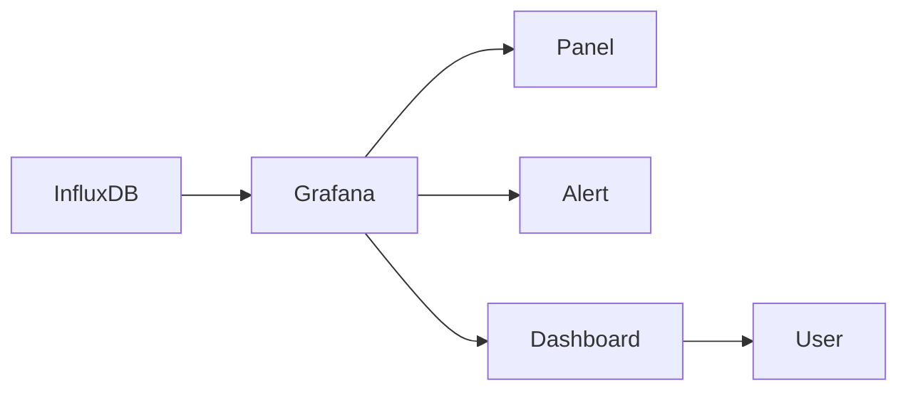
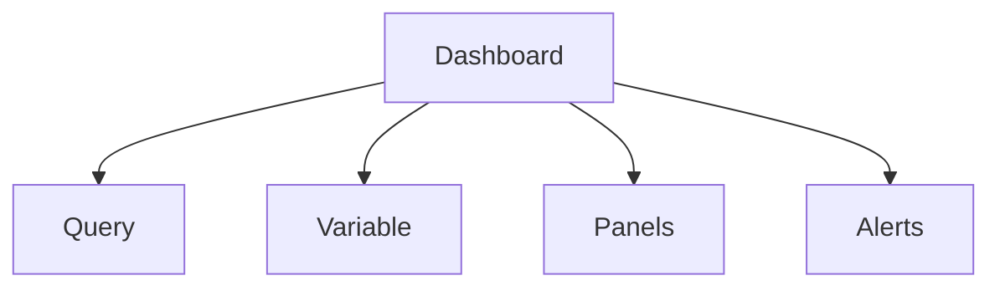

# ทฤษฎี Grafana

## Grafana คืออะไร

Grafana เป็นเครื่องมือสำหรับแสดงผลข้อมูลในรูปแบบ dashboard โดยสามารถเชื่อมต่อกับแหล่งข้อมูลหลายประเภท เช่น InfluxDB, Prometheus, PostgreSQL และอื่น ๆ

## รูปประกอบบทบาทของ Grafana

## บทบาทของ Grafana ในระบบ IoT

ในระบบ IoT Grafana ใช้เพื่อ

- ดูสถานะ sensor แบบ real-time
- ดูแนวโน้มย้อนหลัง
- สร้าง dashboard แยกตามเครื่องจักรหรือพื้นที่
- สร้าง alert จากค่าที่ผิดปกติ

## องค์ประกอบของ dashboard

- panel ใช้แสดงข้อมูลแต่ละชุด
- query ใช้ดึงข้อมูลจาก data source
- variable ใช้ทำ dashboard แบบเลือก device หรือช่วงเวลาได้
- alert ใช้แจ้งเตือนเมื่อข้อมูลเกิน threshold

## รูปประกอบองค์ประกอบของ dashboard

## หลักคิดการออกแบบ dashboard ที่ดี

- แยก dashboard ตามหน้าที่ เช่น monitoring, maintenance, energy
- อย่าใส่ panel มากเกินไปในหน้าเดียว
- ใช้หน่วยให้ถูกต้อง เช่น องศาเซลเซียส, bar, volt
- เลือกช่วงเวลาเริ่มต้นให้เหมาะกับผู้ใช้งาน
- จัดเรียง panel ตามความสำคัญของข้อมูล

## การเชื่อมกับ InfluxDB

Grafana จะ query ข้อมูลจาก InfluxDB แล้วแสดงผลในรูปแบบกราฟ ตาราง gauge หรือ stat panel

ในโครงการนี้ InfluxDB จึงเป็นแหล่งข้อมูลหลักของ Grafana

## ข้อควรระวัง

- query ที่กว้างเกินไปจะใช้ RAM และ CPU เพิ่มขึ้น
- dashboard ที่มี panel มากอาจทำให้ Pi ตอบสนองช้าลง
- ควรใช้ retention และ downsampling ร่วมกันในระบบที่เก็บข้อมูลนาน

---

Copyright (c) 2026 Mr. Nakarin Sripanya  
Department of Electrical Engineering  
Faculty of Industry and Technology  
Rajamangala University of Technology Isan, Sakon Nakhon Campus
