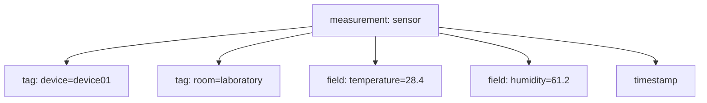

# ทฤษฎี InfluxDB

## InfluxDB คืออะไร

InfluxDB เป็นฐานข้อมูลแบบ time-series database ที่ออกแบบมาสำหรับข้อมูลที่มีเวลาเป็นแกนหลัก เช่น ค่าจาก sensor, telemetry, event log และค่าทางอุตสาหกรรมที่เกิดต่อเนื่องตามเวลา

## รูปประกอบโครงสร้างข้อมูลแบบ time-series



## เหตุผลที่ time-series database เหมาะกับงาน IoT

ข้อมูล IoT ส่วนมากมีรูปแบบดังนี้

- เกิดซ้ำตามรอบเวลา
- มี timestamp กำกับ
- ต้องการดูแนวโน้มย้อนหลัง
- ต้องการ aggregate เป็นช่วงเวลา เช่น เฉลี่ยต่อ 1 นาที หรือ 1 ชั่วโมง

ฐานข้อมูลทั่วไปทำได้ แต่ time-series database จะเหมาะกว่าในแง่ประสิทธิภาพและโครงสร้างข้อมูล

## แนวคิดหลักของ InfluxDB 2

- `organization` ใช้จัดกลุ่มการใช้งาน
- `bucket` ใช้เก็บข้อมูลตาม retention policy
- `measurement` เปรียบได้กับชื่อชุดข้อมูล
- `tag` ใช้เก็บข้อมูลเชิงจัดหมวด เช่น device id, line, location
- `field` ใช้เก็บค่าที่วัดได้จริง เช่น temperature, pressure
- `timestamp` คือเวลาเกิดข้อมูล

## ตัวอย่างเชิงแนวคิด

```text
measurement: sensor

tag:
  device=device01
  room=laboratory

field:
  temperature=28.4
  humidity=61.2

timestamp:
  2026-03-12T09:30:00Z
```

## หลักการออกแบบข้อมูลที่ดี

- ใช้ `tag` กับค่าที่ใช้ filter บ่อย
- ใช้ `field` กับค่าที่เป็นตัวเลขหรือค่าที่เปลี่ยนตลอด
- ตั้งชื่อ measurement ให้สื่อความหมาย
- แยก bucket ตามอายุข้อมูลหรือประเภทงานถ้าจำเป็น

## รูปประกอบเส้นทางข้อมูลเข้าสู่ InfluxDB


## Retention และการบริหาร storage

InfluxDB สามารถตั้ง retention ได้เพื่อไม่ให้ข้อมูลโตไม่สิ้นสุด

หลักคิดคือ

- ข้อมูลดิบความละเอียดสูงเก็บระยะสั้น
- ข้อมูลสรุปหรือข้อมูล aggregate เก็บระยะยาวกว่า
- ติดตามพื้นที่ disk อย่างต่อเนื่อง

## บทบาทในโครงการนี้

InfluxDB ทำหน้าที่เป็นจุดเก็บข้อมูลกลางสำหรับ Grafana และรับข้อมูลจาก Node-RED ที่ subscribe มาจาก MQTT อีกทอดหนึ่ง

---

Copyright (c) 2026 Mr. Nakarin Sripanya  
Department of Electrical Engineering  
Faculty of Industry and Technology  
Rajamangala University of Technology Isan, Sakon Nakhon Campus
